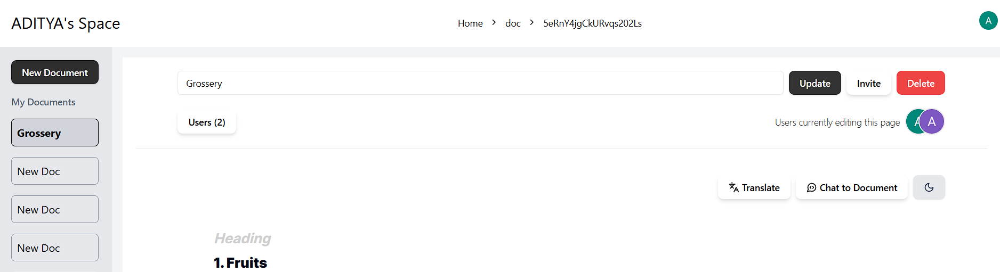
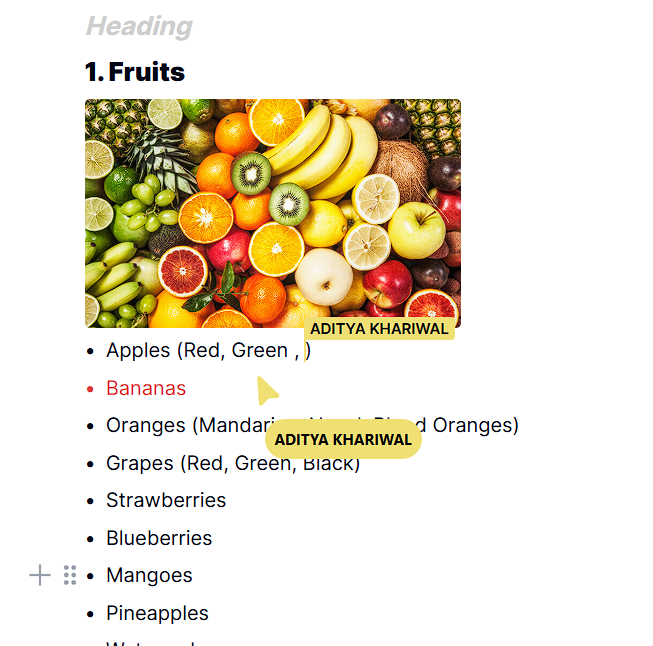
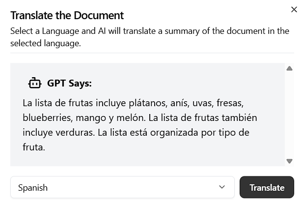

# AI Notion Clone – Real-Time Collaborative Workspace

A full-stack, real-time collaborative workspace inspired by Notion, featuring live editing, multi-user presence, and AI-powered document capabilities.

---

## 📸 Demo

### Editor & Real-Time Collaboration


###  Live Cursors & Multi-User Presence


### AI Features (Summarization / Translation)


---

## Features

- **Real-time Collaboration**  
  Live cursors and conflict-free rich text editing using Liveblocks  

- **Hierarchical Document System**  
  Nested pages with dynamic content rendering  

- **AI-Powered Editing**  
  Document summarization and translation using OpenAI & Cloudflare AI  

- **Authentication & Access Control**  
  Secure user authentication with Clerk and role-based permissions  

- **Low-Latency Serverless Backend**  
  Built with Cloudflare Workers and Hono  

- **Persistent Storage**  
  Firebase Firestore for scalable, real-time data storage  

- **Modern UI/UX**  
  Responsive and accessible interface using Tailwind CSS and shadcn/ui  

- **Deployed on Vercel**  
  Fast, globally distributed deployment  


---

## Tech Stack

### Frontend
- Next.js 15
- TypeScript
- React
- Tailwind CSS
- shadcn/ui

### Backend
- Cloudflare Workers
- Hono

### Real-time
- Liveblocks

### Database
- Firebase Firestore

### AI
- OpenAI API
- Cloudflare AI

### Auth
- Clerk

### Deployment
- Vercel

---

## ⚡ Getting Started

### 1. Clone the repository
```bash
git clone https://github.com/Aditya-Khariwal/notion-clone.git
cd ai-notion-clone
```

### 2. Install dependencies
```bash
npm install
```

### 3. Setup environment variables
Create a .env.local file and add the api

```env
NEXT_PUBLIC_CLERK_PUBLISHABLE_KEY=your_clerk_publishable_key
CLERK_SECRET_KEY=your_clerk_secret_key
NEXT_PUBLIC_LIVEBLOCKS_PUBLIC_KEY=your_liveblocks_key
FIREBASE_API_KEY=your_firebase_api_key
OPENAI_API_KEY=your_openai_api_key
CLOUDFLARE_API_KEY=your_cloudflare_api_key
```

### Run locally 

```bash
npm run dev
```

